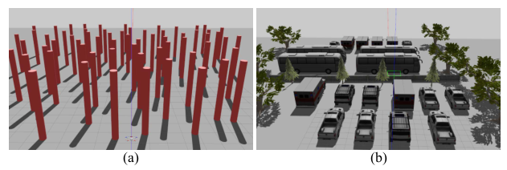
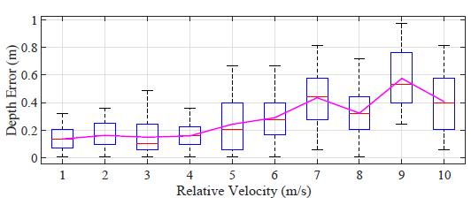
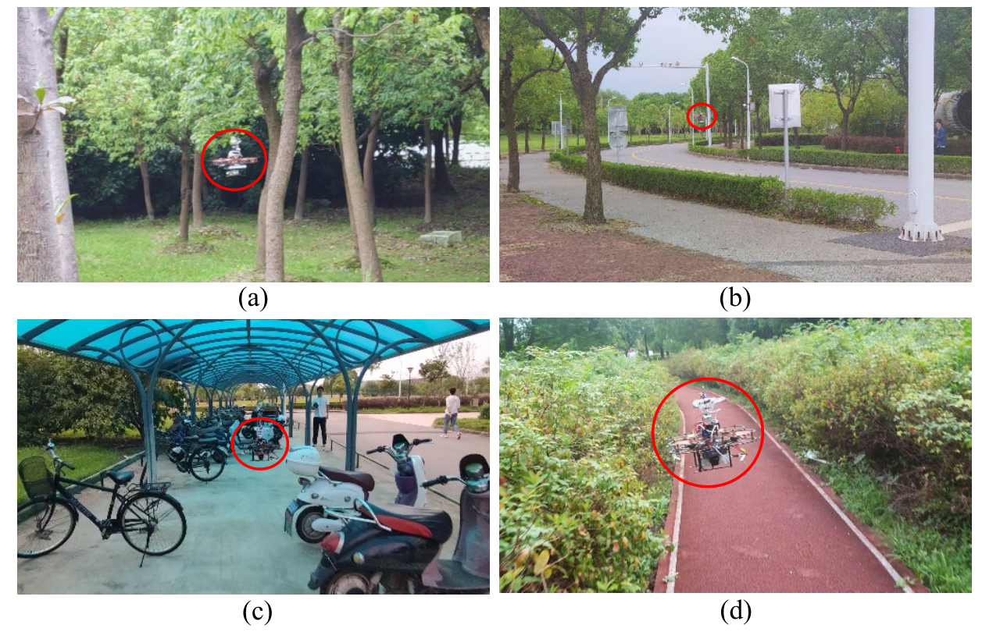

This repository is for paper *Efficient Local Trajectory Planning for High Speed Flight of a Quadrotor with Active Sensing*.
# Building Environment
- Ubuntu 16.04, ROS Kinetic
- Ubuntu 18.04, ROS Melodic

# Building Dependencies
- Eigen
- PCL
- [Ewok](https://github.com/VladyslavUsenko/ewok/tree/master/ewok_ring_buffer/include/ewok). A version with our required IO functions is included in *nags_planning/include*.

# Building Steps
Clone this repository to your ROS workspace and run
```
catkin_make
```

# Usage
- Set the state limitation parameters in */nags_planning/others/compute_pva_table.cpp* and then compile and run this cpp to calculate a state limitation table to get the time for each motion primitive. The calculation may take a long time and is suggested to be concudted in a high-performance computer.
- Copy the computed table to the onboard computer. Modify the parameters in */nags_planning/cfg/setting.yaml* to set the parameters for the planner. The path of this table should be replaced.
- Launch */nags_planning/launch/local_planning_gradient_sample.launch*.

# Test Results
## Simulation Result
- Test scenarios:



Map (a) is composed of cylinders with random positions to simulate a forest.

Map (b) is a parking lot with various vehicles and some natural trees.

Twenty trials were tested in each map.

- Tabel I Simulation Test Results in Map (A)

| Algorithm       | Avg.Sample Times | Avg. Flight Time | Collision Times | Trapped Times |
|-----------------|------------------|------------------|-----------------|---------------|
| MPFM [1]        | -                | 48.5s            | 0               | 11            |
| MPFM Aggressive*| -                | 26.7s            | 6               | 4             |
| U. Sampling [2] | 2.8              | 31.9s            | 0               | 0             |
| Our Planner     | 2.5              | 25.0s            | 0               | 0             |

- Tabel II Simulation Test Results in Map (B) 

| Algorithm       | Avg.Sample Times | Avg. Flight Time | Collision Times | Trapped Times |
|-----------------|------------------|------------------|-----------------|---------------|
| MPFM [1]        | -                | 72.9s            | 0               | 0             |
| MPFM Aggressive*| -                | 35.8s            | 14              | 0             |
| U. Sampling [2] | 12.7             | 44.9s            | 5               | 2             |
| Our Planner     | 3.6              | 42.7s            | 0               | 0             |

[1] T. T. Mac, C. Copot, A. Hernandez, and R. De Keyser, “Improved potential field method for unknown obstacle avoidance using uav in indoor environment,” in 2016 IEEE 14th International Symposium on Applied Machine Intelligence and Informatics (SAMI), 2016, pp. 345–350.

[2] B. T. Lopez and J. P. How, “Aggressive 3-d collision avoidance for high-speed navigation.” in International Conference on Robotics and Automation (ICRA). IEEE, 2017, pp. 5759–5765.

*We use the forces given by MPFM to generate acceleration setpoint directly to realize high-speed flight.

## Realworld Tests
### Qaudrotor Specification

| Rotor Base | Propeller Size | Motor           | Weight | Flight Controller | Onboard Computer |
|------------|----------------|-----------------|--------|-------------------|------------------|
| 210 mm     | 5 inches       | T-motor F40 Pro | 1.2 kg | Pixracer          | Up core board    |

### Sensor Specification

| Sensor                | Property                                                             | Usage                                                                |
|-----------------------|----------------------------------------------------------------------|----------------------------------------------------------------------|
| Intel Realsense D435  | Max Range: about 10m FOV: 86°x 57°                                   | To generate pointclouds at 30Hz.                                     |
| Intel Realsense T265  | Providing under 1% closed  loop drift under intended use conditions. | To provide state estimation of the quadrotor.                        |
| FT motor SM30BL       | Angle resolution: 0.088° Max torque: 10kg*cm                        | To control the active sensing camera and measure its angle.          |
| MPU9250               | Invensense MPU9250 Accel/Gyro/Mag (4 KHz)                           | Integrated by the Pixracer controller for attitude esimation.        |

**Limitations:**
- The state estimation given by the V-SLAM algorithm of Intel Realsense T265 might drift in some scenarios. For example, when the grass and leaves are waving because of the wind from the propeller or the natural wind in a woods, the state estimation from the V-SLAM would drift obviously. State estimation drifting could cause crashes during the flight. Our real-world tests were conducted in the scenarios where the drifting is small (we consider the drifting small if the quadrotor can hover stably). 
- The Intel Realsense D435 is unable to detect the obstacles that are too thin or too tiny. In our test, a stick with the diameter of 2 cm can only be partially detected within 2.7 m and fully detected within 2 m. When the sunlight is very strong, the depth data might be noisy.
- During high speed flight, Realsense D435 could have non-negligible motion blur. We did a test to measure this motion blur in our work *Bio-inspired Obstacle Avoidance for Flying Robots with Active Sensing*. The depth estimation error caused by the motion blur is shown in the image below, where the x-axis is the relative velocity between the camera and the obstacle.



### **Test video**

See:
<https://youtu.be/07Mtvn71aVM>

- Test scenarios:



# Citation

```
@inproceedings{ActiveSensing,
title={Efficient Local Trajectory Planning for High Speed Flight of a Quadrotor with Active Sensing},
author={Chen, Gang and Sun, Dongxiao and Dong, Wei and Sheng, Xinjun and Zhu, Xiangyang and Ding, Han},
booktitle={Under revision},
year={2021}}
```

```
@inproceedings{ActiveSensing,
title={Bio-inspired Obstacle Avoidance for Flying Robots with Active Sensing},
author={Chen, Gang and Dong, Wei and Sheng, Xinjun and Zhu, Xiangyang and Ding, Han},
booktitle={arXiv preprint arXiv:2010.04977},
year={2020}}
```

# License
+ The head files in *nags_planning/include* follows the LGPLv3 License.
+ The rest code is licensed under the New BSD License. 

# Acknowledgement
We thank Shuhan He, Jiayi Li and Boyu Zhou for their help on this work.
